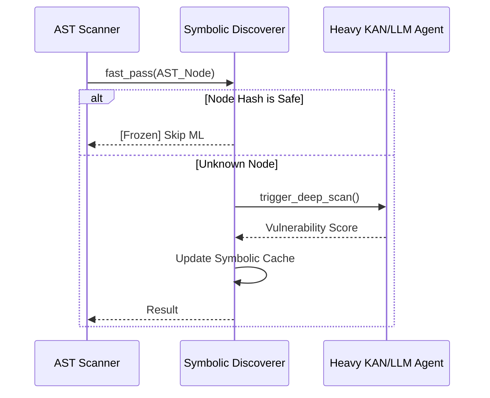

# 🧠 ML Core (Ядро Машинного Обучения)

Модуль `ml_core` содержит фундаментальные математические и системные примитивы, перенесенные из Clojure KAN.

## 1. Symbolic Discovery & Edge Freezing (`symbolic.rs`)

**Проблема:** Вызов тяжелых агентов (LLM или KAN) для каждого AST-узла непомерно дорог.
**Решение:** Символическое хеширование. Если AST-поддерево логически эквивалентно известному безопасному паттерну, грань графа "замораживается".

## 2. Operator Algebra (`operator_algebra.rs`)
Отношение к AST-трансформациям как к математическим функциям, которые можно композировать, обращать и доказывать их безопасность до применения. 

## 3. Normalizing Flows (`normalizing_flow.rs`)
Построение многомерного распределения вероятностей (нормализующий поток) для характеристик кода проекта (скорость изменений, объем зависимостей). Выход за пределы доверительного интервала помечается как `Anomaly (Supply Chain Attack)`.

## 4. Hybrid State (Mutable Core / Immutable Shell) (`hybrid_state.rs`)
Внутренний цикл актора работает на небезопасных сырых указателях (для скорости C/С++), но состояние изолируется и снапшотится в Immutable структуру перед отправкой другим акторам (Event Sourcing).
