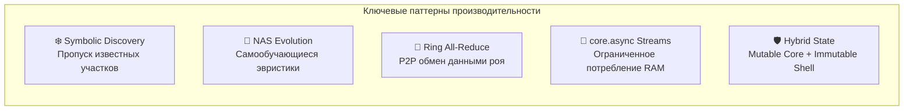

# 🏗️ KAN Intelligence — Архитектурная документация

> Документация архитектуры подсистемы KAN (Kolmogorov-Arnold Network) из проекта `duo-agents`, портированной с Clojure.

## Индекс архитектурных документов

| # | Документ | Содержание |
|---|---|---|
| **HLD** | [🏗️ KAN HLD Архитектура](00_KAN_HLD.md) | **Общий обзор системы**, C4-контекст, карта компонентов 4-х подсистем, 2 Mermaid-диаграммы. |
| **01** | [🧠 Ядро Машинного Обучения (ML Core)](01_ML_Core.md) | Symbolic Discovery (Edge freezing), Operator Algebra, Normalizing Flows, Hybrid State. |
| **02** | [🧬 Эволюционные Правила (Security Rules)](02_Security_Rules.md) | Neural Architecture Search (NAS) для эвристик, LoRA-адаптация замороженных правил. |
| **03** | [🚀 Инфраструктура и Пайплайн](03_Pipeline_Infra.md) | Lazy DAG, Ring All-Reduce, потоки `core.async`, Checkpointing, LR Finder. |

## Ключевые архитектурные паттерны KAN

> **Пояснение:** Эти паттерны превращают обычный линтер (DFS обход AST) в когнитивный Swarm-интеллект (AI Security Agent). Вместо статических регулярных выражений используются генетические алгоритмы (NAS) и LoRA для адаптации. При росте объемов кода система защищена ленивыми графами (Lazy DAG) и потоковой передачей (`core.async`).
